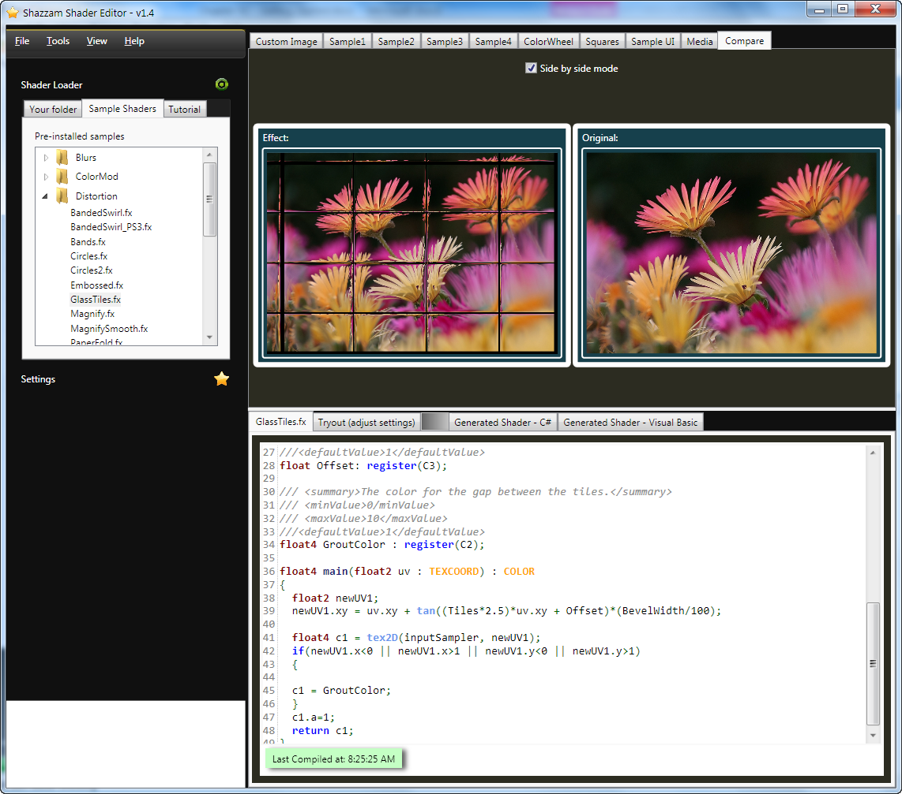

# Shazzam 着色器编辑器

Shazzam 着色器编辑器是一个免费的用于编写 XAML 着色器的独立工具（[图 2-1]()）。
如果您安装了它，您就不需要再安装那庞大的 DirectX SDK，因为它拥有自己的编译器。
它包含了一个具有智能提示和自动补全的 HLSL 代码编辑器。
在您知道 Visual Studio 没有 HLSL 的智能提示之前，这可能看起来不是什么大问题。
在这一章的前面，我提到了在 Expression Blend 中有效果预览的功能。
Shazzam 比 Blend 做得更加好，具有一系列的预留、动画和比较功能。
Shazzam 已经有 4 年的历史了，在全球拥有数千名的用户。
基本在市面上每一本的 Silverlight 书籍都会推荐它作为着色器工具。

我必须告诉您，基于诚实，我是 Shazzam 的主要开发者。
当然，我认为它是学习 XAML 尤其是 HLSL 的最佳工具。
我建议您从 <http://shazzam-tool.com>[^note] 下载一份免费副本并亲自尝试一下。
我在本书广泛地用到了 Shazzam，所以请务必阅读[第 6 章]()来学习更多关于该工具的信息。

要安装 Shazzam，请从 [shazzam-tool.com](http://shazzam-tool.com) 下载安装程序并按照提示操作。
在大部分的电脑上，安装时间不到一分钟。

*图 2-1。Shazzam 着色器编辑器 IDE*

[^note]：原网站已不可访问，可以[点击这里](../tools/Shazzam_v1.5.Setup.exe)下载