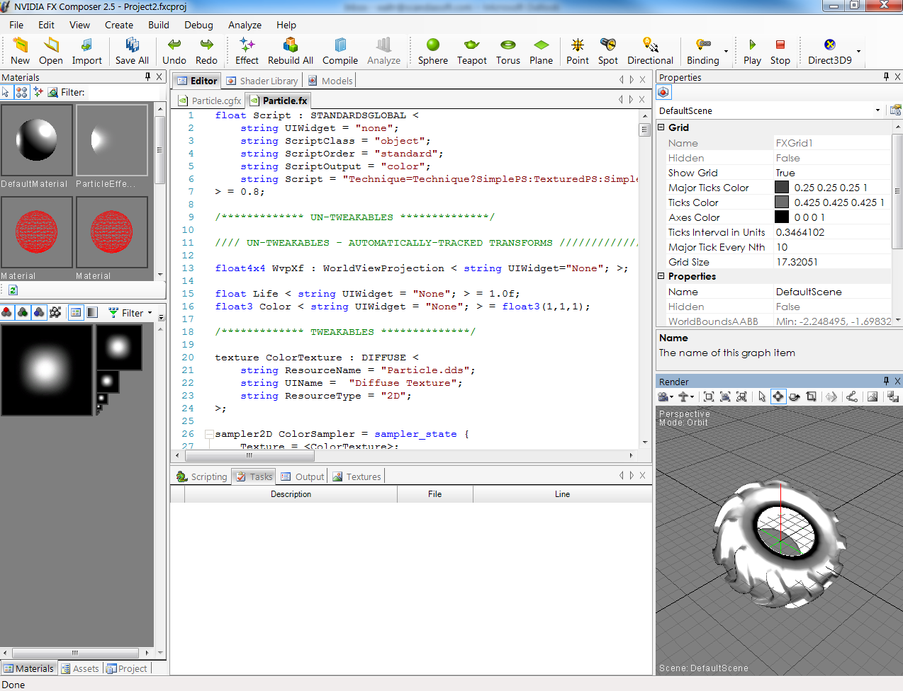

# FX Composer

NVidia 在着色器社区中占有一席之地，并且它拥有许多开发者工具。
在这些令人印象深刻的工具里面，其中一个就是 FX Composer。
它面向游戏开发社区，并拥有大量出色的功能。
它拥有一个着色器调试器，支持轻松导入 3D 模型，具备粒子系统生成器，测试工具和许多其它非常酷的增强功能（[图 2-2]()）。

这是一个令人印象深刻的工具，但我发现用它来为 Silverlight 或 WPF 创建像素着色器就像是杀鸡用牛刀。
您可以在 NVidia 的网站 <http://developer.nvidia.com/fx-composer/> 上找到它。

*图 2-2。NVidia FX Composer IDE*