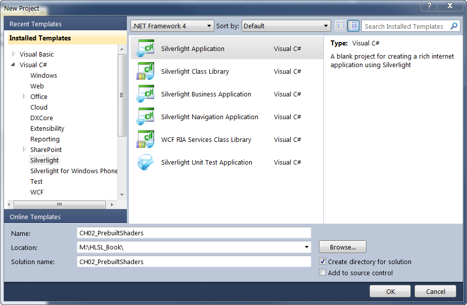
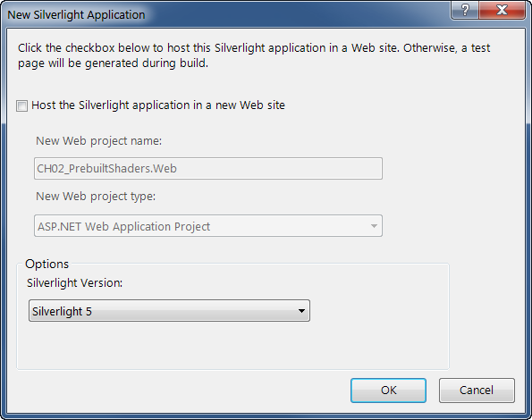
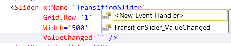

# 使用内建效果

在 Silverlight 和 WPF 有两种内建效果：*阴影* 和 *模糊*。
这两种效果都能应用到任意的 ```UIElement```，相当于可视树上的任何元素。
当一个效果应用到一个元素上时，它会影响到这个元素以及它的所有子元素。
在我们的第一个项目中，您将会把效果放置在一个 Image 元素上。

首先，打开您的 Visual Studio 并从菜单栏选择文件→新项目（或者按 Ctrl-Shift-N）。
这时新项目对话框会打开，提供了许多的选项，如[图 2-3]()。



*图 2-3。新项目对话框*

选择 Silverlight 应用程序模板。
输入一个您选择的名字，然后单击确定按钮。
Visual Studio 将会为您创建 Silverlight 应用程序。

此时将出现新的 Silverlight 对话框，询问您是否要将这个应用程序托管在一个新的网站上（[图 2-4]()）。
对于简单的 Silverlight 应用程序来说，我很少会创建一个托管网站项目，所以我建议取消选择这个复选框。
剩余的设置项我们就保持默认，然后点击确定按钮。



*图 2-4。新 Silverlight 应用程序对话框*

使用菜单栏中的项目→添加现有文件的方式将几个图像文件添加到项目中。

接下来，打开 *MainPage.xaml* 文件并修改 UserControl 元素上的值如下。

```
d:DesignHeight="600" d:DesignWidth="800"
```

设置 DesignHeight 和 DesignWidth 属性以让图片更好地在 Visual Studio 设计器中看到。

添加如下的 XAML 到 *MainPage.xaml* 文件中（[例子 2-1]()）。

*例子 2-1。添加图片和滑块 XAML*
```xaml
<Grid x:Name="LayoutRoot"
      Background="White">
  <Grid.RowDefinitions>
    <RowDefinition Height="380" />
    <RowDefinition Height="40" />
  </Grid.RowDefinitions>
  <!-- 设置 Source 为您的项目中的有效路径 -->
  <Image x:Name="StartImage"
         Source="garden1.jpg"
         Width="500"
         Opacity="1"></Image>

  <!-- 设置 Source 为您的项目中的有效路径 -->
  <Image x:Name="EndImage"
         Source="garden2.jpg"
         Width="400"
         Opacity="0"></Image>
  <Slider x:Name="TransitionSlider"
          Grid.Row="1"
          Width="500" />
</Grid>
```

在[例子 2-1]() 中的 XAML 创建了两个 Image 元素，其中一个叠在了另一个上面。
```EndImage``` 的宽度比 ```StartImage``` 的宽度要小，以突出过渡效果。
此外在网格的底部还有一个 ```Slider``` 元素，用于控制过渡量。

[图 2-5]() 显示了当前 UI 看起来的样子：


*图 2-5。过渡项目，阶段 1*

在下一阶段，您将添加几行代码，在滑块移动的时候，这两个图像会淡入淡出。
首先添加 ```ValueChanged``` 事件处理器到当前的 XAML 中。
经验丰富的 XAML 开发者知道当他们在 XAML 编辑器中添加一个事件标签的时候，Visual Studio 会显示一个*新事件处理器*的提示（[图 2-6]()）。
在提示中按下 Tab 键，标签就会有一个正确的值，并且在后置代码中会生成响应的事件处理。



*图 2-6。插入新事件处理器提示*

当您完成了这些，您的滑块的 XAML 看起来应该像[例子 2-2]()。

*例子 2-2。ValueChanged 事件文本* 

```xaml
<Slider x:Name="TransitionSlider"
        Grid.Row="1"
        Width="500"
        ValueChanged="TransitionSlider_ValueChanged" />
```

按下 F7 键转到后置代码视图中，并将下面的代码加到 C# 文件中（[例子 2-3]()）。

*例子 2-3。TransitionSlider_ValueChanged 事件代码*
```csharp
private void TransitionSlider_ValueChanged(object sender, RoutedPropertyChangedEventArgs<double> e)
{
    // 过渡图片
    var max = TransitionSlider.Maximum;
    EndImage.Opacity = e.NewValue / max;
    StartImage.Opacity = 1 - EndImage.Opacity;
}
```

如你所见，这段代码改变了两个 Image 元素的不透明度。
不透明度有效范围是 0.0 到 1.0，所以我们通过计算来约束滑块的当前值在此范围内。

```e.NewValue / max```

最后一行确保当 ```StartImage.Opacity``` 为 0.0 时，```EndImage.Opacity``` 的值为 1.0，反过来也是一样。

```StartImage.Opacity = 1 - EndImage.Opacity;```

运行程序并滑动滑块。第一张图片会消失且第二张图片会淡入视图。