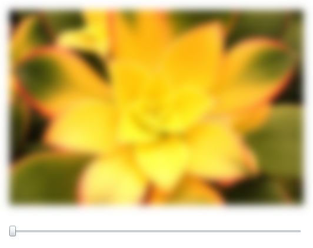

# 添加效果

为了让过渡效果更有意思，您可以在淡入淡出期间应用一个 BlurEffect。
对于想查看内建效果的话，BlurEffect 是一个不错的选择。
它是内建的其中一个效果，在 Silverlight 和 WPF 中都可以使用，而且用起来相当简单。
图形行业中使用了各种各样的模糊效果（运动模糊，缩放模糊，高斯模糊）。
BlurEffect 类是其中最简单的实现，给受影响的像素看上去没有聚焦的样子。
您看到的效果就像隔着一层磨砂半透明屏幕一样。

> BlurEffect 使用了一个简单的模糊算法，虽然有效但比其它的模糊算法慢。
> 一个自定义的 BoxBlur[^note] 或者优化的高斯模糊算法会比 WPF 内置的模糊更优。

每一个 ```UIElement``` 都有一个 ```Effect``` 属性。
在这个项目，可能受影响的有 ```UserControl```，```Grid```，```Slider``` 和两个 ```Image``` 元素。
当您把效果应用到父级元素，例如 Grid，那么将会影响到它的所有子级。
每一个元素只能通过 ```Effect``` 属性直接设置一个效果，但它们也会从它们的父级继承其它效果。
想象一下应用一个 ```BlurEffect``` 到父级 Grid（```LayoutRoot```）和一个 ```InvertColorEffect``` 到 ```StartImage```。
```StartImage``` 将会被应用到两种效果，而 ```EndImage``` 只会显示模糊效果。

```BlurEffect``` 有一个有趣的属性：*Radius*。
您可以认为 Radius 是模糊效果的强度。
Radius 的值越高，输出越模糊。

这里展示如何添加一个 ```BlurEffect``` 到 XAML（[例子 2-4]()）。

*例子 2-4。在 XAML 中添加 BlurEffect*

```XAML
<Image x:Name="StartImage"
       Source="garden1.jpg"
       Width="500"
       Opacity="1">
  <Image.Effect>
    <BlurEffect Radius="20" />
  </Image.Effect>
</Image>
```

当然，您可以在后置代码中应用效果（[例子 2-5]()）。

*例子 2-5。在代码里添加 BlurEffect*

```csharp
var blur = new System.Windows.Media.Effects.BlurEffect();
blur.Radius = 20;
StartImage.Effect = blur;
```

现在效果已经应用上了，运行程序。UI 应该看起来类似[图 2-7]()。



*图 2-7。带有模糊效果的 Image 元素*

您准备好添加模糊效果到过渡了吗？
首先将现有的模糊效果的 Radius 值设置为 0。
然后添加一个模糊到 ```EndImage```（[例子 2-6]()）。

*例子 2-6。两张图片模糊效果*

```xaml
<Image x:Name="StartImage"
       Source="garden1.jpg"
       Width="500"
       Opacity="1">
  <Image.Effect>
    <BlurEffect x:Name="StartImageBlur"
                Radius="0" />
  </Image.Effect>
</Image>
<Image x:Name="EndImage"
       Source="garden2.jpg"
       Width="480"
       Opacity="0">
  <Image.Effect>
    <BlurEffect x:Name="EndImageBlur"
                Radius="0" />
  </Image.Effect>
</Image>
```

接下来，编写一些代码来应用模糊类似于不透明度的变化。
修改 ```ValueChanged``` 事件处理器如下（[例子 2-7]()）：

*例子 2-7。值变化事件生成代码*

```csharp
// 过渡图片
var max = TransitionSlider.Maximum;
EndImage.Opacity = e.NewValue / max;
StartImage.Opacity = 1 - EndImage.Opacity;

// 透明度范围从 0.0 到 1.0
// 我们希望模糊半径的最大值是 20，所以这里乘以 20
StartImageBlur.Radius = EndImage.Opacity * 20;
EndImageBlur.Radius = StartImage.Opacity * 20;
```

项目完成了。
运行程序并观察过渡。
在第一张图片淡出模糊的同时，第二张图片会淡入清晰。
不错的效果！
我很快会展示给您如何创建自定义效果，但在这之前，对于性能，我有一些想说。

[^note]：<https://en.wikipedia.org/wiki/Box_blur>