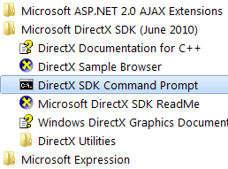

# 编译 HLSL 代码

接下来，需要将 ```InvertColor``` 着色器编译成一个二进制文件。
按照惯例，这个二进制文件以 *.ps* 扩展名结尾。
这里有很多种方法可以编译着色器源代码。
对于这第一次的演练，您将会使用 DirectX SDK 中的 FXC.EXE 编译器。
如果您已经安装了 SDK，您可以从 Windows 的开始菜单中打开 DirectX 命令提示符，如[图 2-8]() 所示。



*图 2-8。开始菜单中的 DirectX 命令行提示符*

在 DirectX 提示符中，运行这个命令以运行 FXC 编译器。

```bash
fxc /T ps_2_0 /E main /Fo output.ps invertcolor.txt
```

编译器会从 *invertcolor.txt* 文件中获取代码并将它编译到 *output.ps* 文件中。
这里指定了一些开关，告诉编译器用 ```main``` 函数作为入口点和使用 ps_2_0 着色器规范进行编译。

预先警告一下：FXE 对输入文件的编码很挑剔。它倾向 ASCII 编码而不是 Unicode 编码的文本文件。