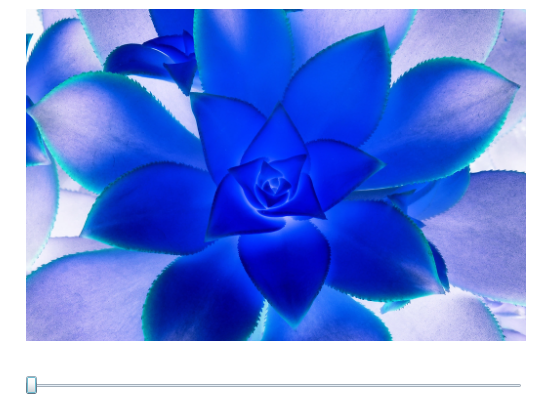

# 实例化着色器

您想把 ```InvertColorEffect``` 添加到图片上要怎样做呢？
如果您想在代码里添加它，您仅仅需要实例化这个效果并且分配到正确的元素属性上。

```csharp
var invert = new InvertColorEffect();
StartImage.Effect = invert;
```

如果是在 XAML 中添加这个效果的话，需要添加一个自定义 XML 命名空间到 ```UserControl``` 上。
这个 xmlns 应该指向包含了您这个包装类的 .NET 命名空间。

```xaml
<UserControl x:Class="Ch02_CustomEffect.MainPage"
             xmlns="http://schemas.microsoft.com/winfx/2006/xaml/presentation"
             xmlns:x="http://schemas.microsoft.com/winfx/2006/xaml"
             xmlns:d="http://schemas.microsoft.com/expression/blend/2008"
             xmlns:mc="http://schemas.openxmlformats.org/markup-compatibility/2006"
             xmlns:local="clr-namespace:Ch02_CustomEffect"
             mc:Ignorable="d">
```

然后应用效果到图片上。

```xaml
<Image x:Name="StartImage"
       Source="garden1.jpg"
       Width="500"
       Opacity="1">
    <Image.Effect>
        <local:InvertColorEffect />
    </Image.Effect>
</Image>
```

请确保注释了 ```TransitionSlider_ValueChanged``` 事件处理器中的代码，否则您会得到一个运行时错误。

[图 2-10]() 是当您运行程序后，InvertColorEffect 看起来的样子。



*图 2-10。InvertColorEffect 应用到图片上*