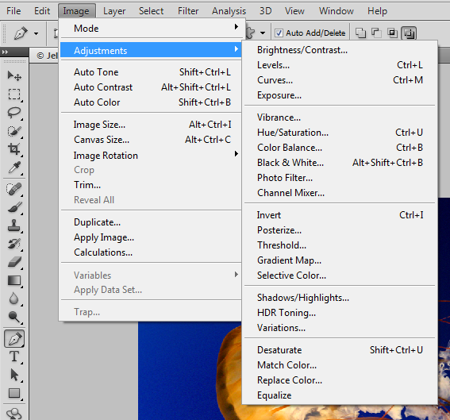

# 常见技术

在电影和印刷行业中，颜色校正是颜色修改的必不可少的用途之一。
您在电视或者杂志上看到的大多数图像都在后期制作过程中进行了颜色校正。
无论是调整边缘曝光的对比度，为时尚杂志创建统一的肤色，还是为哥特式小说海报应用阴暗的色调，大多数商业图像在发布给公众之前都会经过颜色的调整。
颜色校正主要有两种形式：每个通道校正，分别改变红色、绿色和蓝色的分量；颜色混合生成，它的输出值会根据 RGB 通道中的组合来确定。

*风格化*照片是另一种流行的颜色修改技术，例如利用棕褐色调色、引入六十年代的色彩风格、使图像看起来像是来自旧电影、反转颜色或者使用颜色通道。

*去除颜色*是另一种常见的技术。灰度化和去饱和度是这一类技术中最流行的方法。

照片编辑程序里充斥着这一类工具。
打开您的 Adobe Photoshop 并查看图像→调整菜单（[图 3-2]()）。
它包括着多个颜色调整工具，很可能它们在幕后用一个或两个的着色器来完成实际的工作。

*图 3-2。Photoshop 调整菜单*