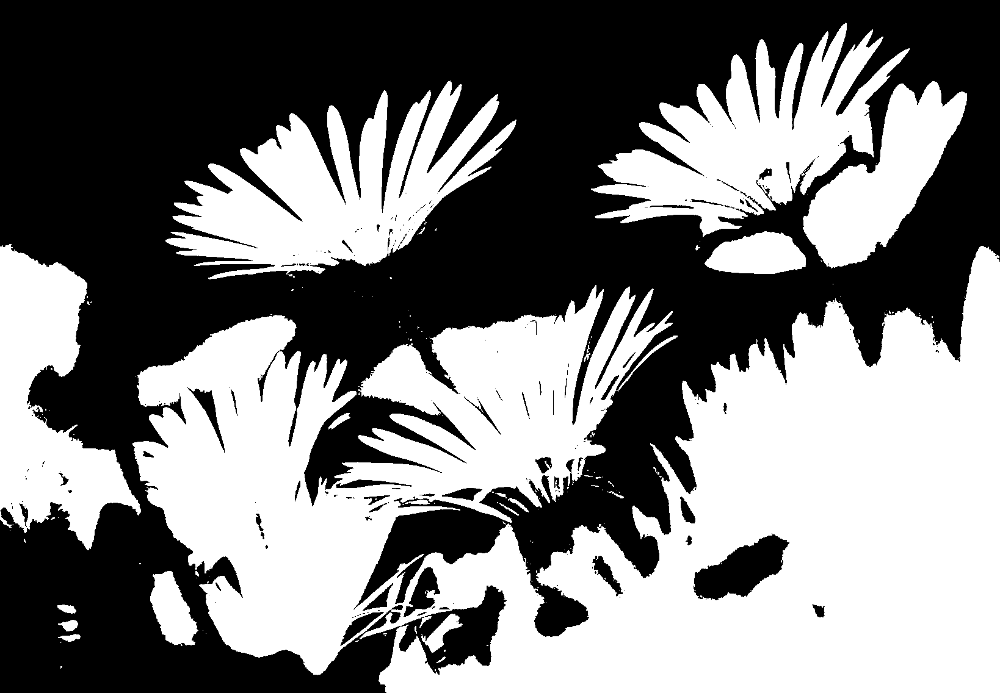

# 黑白

您也许已经在美术杂志上或者在当地的美术馆里看到过黑白照片。
但在多数情况下，它们并不是纯黑白的。它们由多种色调的灰色组合而成。
真正的黑白很少见，但偶尔会用于戏剧效果。

**技巧：** 这个着色器的工作方式是将超过阈值的所有像素设置为白色而其余的设置为黑色（[例子 3-3]()）。
*例子 3-3。黑白伪代码*
```
if (color.r > .5)// 使用红色通道作为阈值触发
{
    RGB(1, 1, 1);
}
else
{
    RGB(0, 0, 0);
}
```

查看[图 3-3]()，这是我们使用原始版本黑白技巧着色器应用到原始图像上的效果。



*图 3-3。黑白效果*