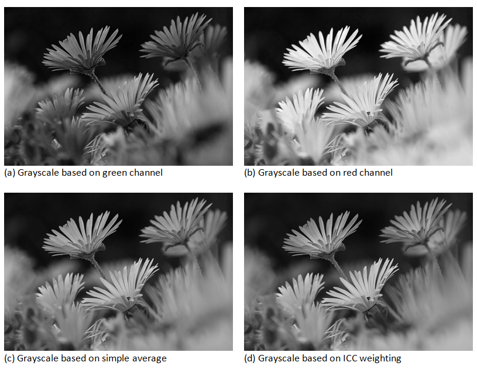

# 灰度

灰度图像看起来没有颜色，只有灰色调。
关于这种图像，其它常用的名称是单色图像和单调图像。

**技巧：** 着色器必须检查每一个像素并决定分配给 RGB 通道什么值。
一种方法是在滤波器中使用单个通道（参见[图 3-4]().a 和 3.4.b）。
例如，取红色通道的值并分配给绿色和蓝色通道。

另一种方法是将颜色通道的值取平均值然后应用到每个 RGB 值上（参见[图 3-4].c）。
然而，对于最现实的方法，不要简单使用平均计算。
在 ICC 涂层实验室的首脑提出了一个不错的加权公式让你的灰度感觉到更加真实（参见[图 3-4]().d）。

```
// 伪代码
gray = RGB(inputColor * 0.21, inputColor * 0.71, inputColor * 0.07)
```

> 人类的眼睛对绿色光谱的敏感度较其它颜色更高。
> 使用这么一个增强绿色光谱的灰度公式得出来的图像看起来会更接近从黑白影片中拍摄的图片。



*图 3-4。基于不同算法的灰度效果*